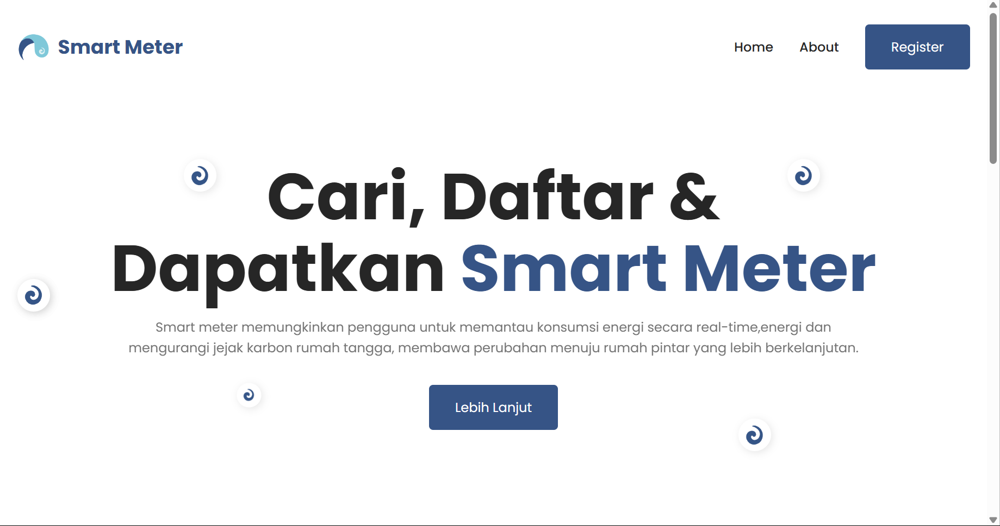
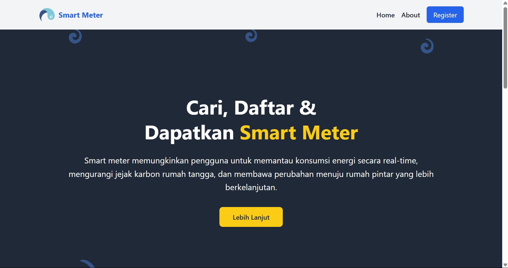

# **Smart Meter**

**Smart Meter** adalah solusi inovatif untuk memantau konsumsi energi rumah tangga secara real-time dan mengurangi jejak karbon. Proyek ini bertujuan untuk menyediakan alat yang efisien dan mudah digunakan untuk membantu pengguna mengelola energi mereka dengan lebih baik.

## **Logo Smart Meter** 


## **Landing Page Smart Meter**

### **Desain CSS**



### **Desain dengan Tailwind**



## 🚀 Fitur Utama
Desain Responsif: Halaman yang dapat diakses dengan baik di berbagai perangkat.
Informasi Produk: Penjelasan mendetail tentang manfaat dan penggunaan smart meter.
Langkah-Langkah Pendaftaran: Panduan mudah untuk mendapatkan smart meter.
Kontak Dukungan: Cara mudah untuk menghubungi tim dukungan jika ada pertanyaan.
## 🔧 Prasyarat
Sebelum memulai, pastikan Anda telah memiliki:

Web Browser: Chrome, Firefox, Safari, atau Edge untuk melihat halaman.
Editor Teks: Untuk mengedit file, seperti Visual Studio Code atau Sublime Text.
## 📥 Instalasi

1. Clone repositori ini:

    ```bash
    git clone https://github.com/Hanifama/landingPage-smartWater.git
    ```

2. Masuk ke direktori proyek:

    ```bash
    cd smart-meter
    ```

3. Buka File di Chorome temen temen semua
    ```

## 📚 Penggunaan

Setelah Anda menginstal dan membuka file index.html, Anda dapat melihat dan menggunakan halaman landing dengan fitur-fitur berikut:

Navigasi: Menu yang memudahkan pengguna untuk berpindah antara halaman.
Header: Bagian utama dengan informasi produk dan gambar menarik.
Langkah-Langkah Pendaftaran: Panduan untuk mendapatkan smart meter.
Kontak Dukungan: Informasi kontak untuk bantuan lebih lanjut.

## 📜 Lisensi

Proyek ini dilisensikan di bawah MIT License. Lihat [LICENSE](path/to/LICENSE) untuk detail lebih lanjut.

## 📬 Kontak

Untuk pertanyaan lebih lanjut, silakan hubungi kami di:

- **Email**: haristfhorison@gmail.com
- **Website**: [smartmeter.com](https://water-meter.pptik.id/)

---

Terima kasih telah membaca README kami dan kami berharap Anda menikmati menggunakan Smart Meter!
